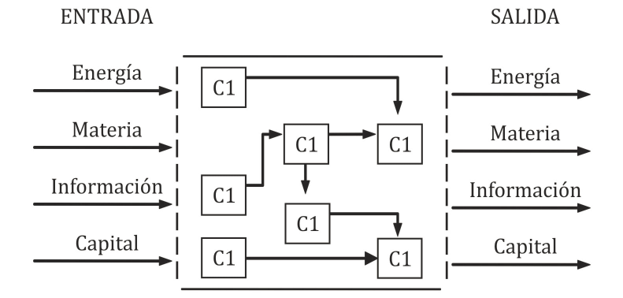

# Projeto :: Atividade API

Um modelo de sistema possui recursos de entrada, um processo de transformação e uma saída.



> CARACTERIZACIÓN BÁSICA DE SISTEMAS PRODUCTIVOS, Scientific Figure on ResearchGate. 
>
>Available from: https://www.researchgate.net/figure/Figura-1-Modelo-basico-de-un-sistema_fig1_307578265 [accessed 20 Nov, 2020]

---

Dados são recebidos como entrada, passam por um processo de transformação e geram algum valor de informação, 
serviço ou produto. A entrada depende do ambiente do sistema. 
Um ambiente com múltiplos canais exige algumas camadas básicas de abstrações.

1. Dados Entrada
2. Nós de ação
3. Canais de saída

Nós de ação facilita a transformação de dados e beneficia a recuperação de informações

```java
class Exemplo {

    public String operacao(){
        return Activity
                   .contract("10")
                   .entry(10)
                   .action(numero -> numero * 2)
                   .exit(String::valueOf);
    }

}
```

        1. Saída esperada é igual "20"
    
---
Nós de decisão controlam o fluxo de atividade. 

```java
class Exemplo {

    public String operacao(){
        return Activity
                   .contract("0")
                   .entry(BigInteger.valueOf(10))
                   .decision(numero -> numero.isProbablePrime(100))
                   .exit(String::valueOf);
    }

}
```

        2. Saída esperada é igual "0"
                      
Um fluxo é desviado a cada ponto crítico, e caso um canal precise realizar uma comunicação inter-processo, basta inserir
um objeto do tipo **Channel**

```java
class Exemplo {

    public String operacao(){
        return Activity
                 .contract("0")
                 .entry(2)
                 .decision(numero -> numero % 3 == 0)
                 .otherwiseChannel(String::valueOf, System.err::println)
                 .channel(System.out::println)
                 .exit(String::valueOf);
    }

}
```

        3. [ERROR] Saída esperada é igual "2"

Canais de saída são essenciais para que possamos realizar trocar mensagem por delegação. 
Para um banco de dados, um mensageiro, por email, por ftp, gravado em arquivo e etc.

## Proposta

**Atividade** contém as principais abstrações necessárias para a construção de um processo. 
Podemos considerar que ele representa o *core* de toda API.

## O que API não faz

1. A API não lida com join de nós de ação
2. Não possui um tipo eficiente de estrutura de encadeamento de condicionais distintas (leia-se else if … ).
3. Como a quantidade de implementação de classes aumenta proporcionalmente a quantidade de processos, a API não aumenta coesão e diminui acoplamento.
4. Por mais que a API tenha mecanismos de abstração que evite falhas de processo, excessões como *NullPointerException* não são resolvidas.
